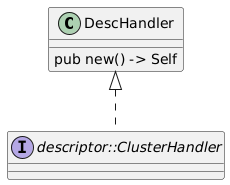
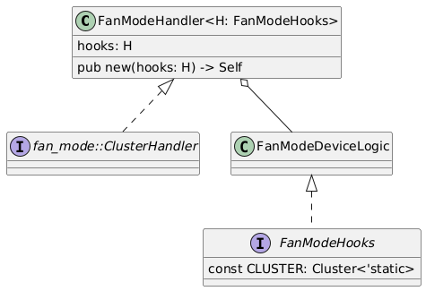
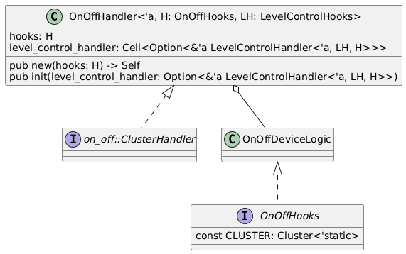

# Matter Clusters - Implementation, Usage and Support

Matter clusters vary in their complexity and hence different implementation patterns have been developed to address different levels of complexity. What follows is a description of the different patterns, when to use them, how to implement them (for SDK contributors) and how to use them (for SDK consumers). A summary detailing the patterns used for different clusters is also provided.

Note: `rs-matter` is still evolving and hence there may be needs that are not met by the patterns discussed here. One pattern of note that is currently missing is that for derived clusters.

# Implementation patterns

`rs-matter` utilises the Interface Definition Language (IDL) to auto-generate all Matter data types and traits for commands. This is the basis of all cluster implementation patterns discussed below.

## Pattern A: Simple Handler

**When to use**: Clusters with no spec-defined logic, purely data-driven, no interdependencies.

**Characteristics**:
- Read-only or simple read/write attributes
- No complex state management
- No coupling with other clusters
- Examples: AirQuality, most measurement clusters

### Implementation

The SDK supports all clusters in this way and does not require any further implementation.

### Usage

1. Import the auto-generated cluster data types and trait using the `rs_matter::import!(<ClusterName>)` macro.
2. Implement the `<cluster>::ClusterHandler` trait on a `<Cluster>Handler` struct or the `<cluster>::AsyncClusterHandler` trait on a `<Cluster>Handler` for handlers that need asynchrony. See code snippet below.
3. Instantiate the `<Cluster>Handler` struct and chain it to the endpoint handler.

```rust
use rs_matter::{self, import};
import!(AirQuality);

struct AirQualityHandler {
    sensor: SensorInterface, // Mock interface
}

impl air_quality::ClusterHandler for AirQualityHandler {
    const CLUSTER: rs_matter::dm::Cluster<'static> = air_quality::FULL_CLUSTER
        .with_revision(1)
        .with_attrs(with!(
            required;
            air_quality::AttributeId::AirQuality
        ));

	fn air_quality(&self, _ctx: impl ReadContext) -> Result<AirQualityEnum, Error> {
        Ok(self.sensor.read_aqi())
    }

	// ...
}

fn main() {
	// Instantiate cluster handler
	let air_quality_handler = AirQualityHandler { sensor: SensorInterface::new() };

	// Build endpoint handler for device clusters
	let device_handler = EmptyHandler
		.chain(
			EpClMatcher::new(Some(1), Some(AirQualityHandler::CLUSTER.id)),
			air_quality::HandlerAdaptor(air_quality_handler),
		)
		// Continue chaining device clusters
}
```

## Pattern B: Implemented Handler

**When to use**:
- No device specific logic. Most often the case for certain system clusters like AccessControl, Descriptor and others.
- The Matter spec defines complex command logic (e.g., state machines, timing requirements)
- The cluster has side effects beyond simple attribute updates
- There are validation rules that must be enforced consistently
- No coupling with other clusters

The Simple Handler pattern works for all clusters, however, some clusters define complex Matter logic which would have to be implemented by every consumer. For these clusters, `rs-matter` implements a `<Cluster>Handler` struct matching the cluster name, e.g. `OnOffHandler`.  This struct implements the corresponding `<Cluster>Handler` trait with all the Matter spec-defined logic.

### Implementation

1. Add the cluster to the `import!` macro call in `rs-matter/src/dm/clusters.rs`.
2. Implement the cluster in `rs-matter/src/dm/clusters`, similar to the usage instructions in **A**.



_Fig 1: Representative UML diagram for Pattern B_

### Usage

1. `use rs_matter::dm::clusters::<cluster>::{<Cluster>Handler}`;
2. Instantiate the `<Cluster>Handler` struct and chain it to the endpoint handler.

```rust
use rs_matter::dm::clusters::desc::{DescHandler}

fn main() {
	// Instantiate cluster handler
	let descriptor_handler = DescHandler::new();

	// Build endpoint handler for device clusters
	let device_handler = EmptyHandler
		.chain(
			EpClMatcher::new(Some(1), Some(DescHandler::CLUSTER.id)),
			Async(descriptor_handler.adapt()),
		)
		// Continue chaining device clusters
}
```

## Pattern B1: Hooks-Based Handler

**When to use**:
- Device specific logic is required
- The Matter spec defines complex command logic (e.g., state machines, timing requirements)
- The cluster has side effects beyond simple attribute updates
- There are validation rules that must be enforced consistently
- No coupling with other clusters

On top of pattern B, this pattern provides a `<Cluster>Hooks` trait, delegating business logic implementation to the SDK consumer. For example; a method to switch the device on or off. Attributes that require persistence are also delegated to the SDK consumer, allowing them to use their own persistence strategy.

### Implementation

1.  Follow all instruction for pattern B.
2. Implement a `<Cluster>Hooks` trait for delegating business logic implementation to the SDK consumer.



_Fig 2: Representative UML diagram for Pattern B1_

### Usage

1. `use rs_matter::dm::clusters::<cluster>::{<Cluster>Handler, <Cluster>Hooks};`
2. Implement `<Cluster>Hooks` for a `DeviceLogic` struct.
3. Instantiate the `<Cluster>Handler` struct with the `DeviceLogic` struct and chain it to the endpoint handler.

```rust
use rs_matter::dm::clusters::fan_mode::{self, FanModeHandler, FanModeHooks, StepDirectionEnum};

// Create device logic functionality
struct FanModeDeviceLogic {
	// Mock controller
	fan_controller: FanController
}

impl FanModeDeviceLogic {
	pub fn new() -> Self {
		Self {
			fan_controller: FanController::new(),
		}
	}
}

// Implement the Hooks trait
impl FanModeHooks for FanModeDeviceLogic {
	// Set the cluster configuration
    const CLUSTER:crate::dm::Cluster<'static> = FanMode::FULL_CLUSTER
        .with_revision(4)
        .with_attrs(with!(
            required;
            fan_mode::AttributeId::FanMode
            | fan_mode::AttributeId::PercentSetting
            // ...
        ))
        .with_cmds(with!(
            fan_mode::CommandId::Step
        ));

	// Implement delegated logic
	fn step(&self, direction: StepDirectionEnum, wrap: bool, lowest_off: bool) {
		self.fan_controller.step(direction, wrap, lowest_off)
	}

	// ...
}

fn main() {
	// Instantiate application cluster
	let fan_mode_handler = FanModeHandler::new(FanModeDeviceLogic::new());

	// Build endpoint handler similar to pattern B.
}

```
## Pattern C: Coupled clusters

**When to use**: Clusters coupled with other clusters.

Certain Matter clusters define coupling behaviour with other clusters. These behaviours often require custom logic, different from cluster commands. Hence, cluster handlers of coupled clusters will need to be aware of each other.

### Implementation

Structurally, pattern C is very similar to pattern B with the following additions to the `<Cluster>Handler`
- Attributes for optionally containing references to coupled clusters. See `level_control_handler` in the UML diagram below.
- A public `init()` method that optionally takes references to the coupled handlers and validates the handler against the `<Cluster>Hooks::CLUSTER` configuration. For example, if LevelControl's OnOff feature is enabled, an OnOff cluster must be present



_Fig 3: Representative UML diagram for Pattern C_

### Usage

1. `use rs_matter::dm::clusters::<cluster>::{<Cluster>Handler, <Cluster>Hooks};`
2. Implement `<Cluster>Hooks` for a `DeviceLogic` struct.
3. Instantiate the `<Cluster>Handler` struct with the `DeviceLogic` struct.
4. Call `init(&<coupled cluster>)` on `<Cluster>Handler`. This initialises the cluster on startup by wiring the coupled handlers and validating the handler setup with the configuration.
5. Chain the `<Cluster>Handler` to the endpoint handler.

```rust
// Implement device logic similar to pattern B.

fn main() {

	// Instantiate device logic handlers
	let on_off_logic = OnOffDeviceLogic::new();
	let level_control_logic = LevelControlDeviceLogic::new();

	// Instantiate cluster handlers
	let on_off_handler = OnOffHandler::new(on_off_logic);
	let level_control_handler = LevelControlHandler::new(level_control_logic);

	// Initialize cluster handlers, coupling clusters if required.
	on_off_handler.init(Some(&level_control_handler))?;
	level_control_handler.init(Some(&on_off_handler))?;

	// Build endpoint handler similar to pattern B.
}
```

# Cluster Support

The following table summarises the implementation pattern types used for Matter v1.3 clusters.
Provisional clusters are not included.

All clusters are supported by pattern A.
✅ indicates that a pattern is required and implemented.
⚫ indicates that a pattern is not required.
❌ indicates that a pattern is required and not yet implemented.
Blank entries indicate that an assessment has not yet been made to identify if the pattern is required.

**Note** Some clusters support multiple patterns, excluding pattern A. Consult the cluster specific documentation for further explanation on how to use them.

**Note** Events are currently not supported. See issue [#36](https://github.com/project-chip/rs-matter/issues/36).


| Cluster                                               | A  | B  | B1 | C  | notes |
| ----------------------------------------------------- | -- | -- | -- | -- | ----- |
| **System Clusters** Matter Specification v1.3.0.1     |    |    |    |    |       |
|                                                       |    |    |    |    |       |
| **9. System Model Specification**                     |    |    |    |    |       |
| Descriptor                                            | ✅ | ✅ | ✅ | ⚫ |       |
| Binding                                               | ✅ |    |    |    |       |
| FixedLabel                                            | ✅ |    |    |    |       |
| UserLabel                                             | ✅ |    |    |    |       |
| AccessControl                                         | ✅ | ✅ | ⚫ | ⚫ |       |
| BridgedDeviceBasicInformation                         | ✅ | ✅ | ⚫ | ⚫ |       |
| Actions                                               | ✅ |    |    |    |       |
| ProxyDiscovery                                        | ✅ |    |    |    |       |
| ProxyConfiguration                                    | ✅ |    |    |    |       |
| ProxyValid                                            | ✅ |    |    |    |       |
| IcdManagement                                         | ✅ |    |    |    |       |
|                                                       |    |    |    |    |       |
| **11. Service and Device Management**                 |    |    |    |    |       |
| BasicInformation                                      | ✅ | ✅ | ⚫ | ⚫ |       |
| GroupKeyManagement                                    | ✅ |    |    |    |       |
| LocalizationConfiguration                             | ✅ |    |    |    |       |
| TimeFormatLocalization                                | ✅ |    |    |    |       |
| UnitLocalization                                      | ✅ |    |    |    |       |
| PowerSourceConfiguration                              | ✅ | ⚫ | ⚫ | ⚫ |       |
| PowerSource                                           | ✅ | ⚫ | ⚫ | ⚫ |       |
| NetworkCommissioning                                  | ✅ | ⚫ | ✅ | ⚫ |       |
| GeneralCommissioning                                  | ✅ | ⚫ | ✅ | ⚫ |       |
| DiagnosticLogs                                        | ✅ |    |    |    |       |
| GeneralDiagnostics                                    | ✅ | ⚫ | ✅ | ⚫ |       |
| SoftwareDiagnostics                                   | ✅ |    |    |    |       |
| ThreadNetworkDiagnostics                              | ✅ | ⚫ | ✅ | ⚫ |       |
| WiFiNetworkDiagnostics                                | ✅ | ⚫ | ✅ | ⚫ |       |
| EthernetNetworkDiagnostics                            | ✅ | ⚫ | ✅ | ⚫ |       |
| TimeSynchronization                                   | ✅ |    |    |    |       |
| OperationalCredentials                                | ✅ | ✅ | ⚫ | ⚫ |       |
| AdministratorCommissioning                            | ✅ | ✅ | ⚫ | ⚫ |       |
| OtaSoftwareUpdateProvider                             | ✅ |    |    |    |       |
| OtaSoftwareUpdateRequestor                            | ✅ |    |    |    |       |
|                                                       |    |    |    |    |       |
| **Application Clusters** Matter Application Clusters v1.3.0.1 | | |  |    |       |
|                                                       |    |    |    |    |       |
| **1. General**                                        |    |    |    |    |       |
| Identify                                              | ✅ | ⚫ | ⚫ | ⚫ |       |
| Groups                                                | ✅ |    |    |    |       |
| OnOff                                                 | ✅ | ⚫ | ✅ | ✅ |       |
| LevelControl                                          | ✅ | ⚫ | ✅ | ✅ |       |
| BooleanState                                          | ✅ |    |    |    |       |
| ModeSelect                                            | ✅ |    |    |    |       |
| LowPower                                              | ✅ |    |    |    |       |
| WakeOnLan                                             | ✅ |    |    |    |       |
| Switch                                                | ✅ |    |    |    |       |
| OperationalState                                      | ✅ |    |    |    |       |
|                                                       |    |    |    |    |       |
| **2. Measurement and Sensing**                        |    |    |    |    |       |
| IlluminanceMeasurement                                | ✅ | ⚫ | ⚫ | ⚫ |       |
| TemperatureMeasurement                                | ✅ | ⚫ | ⚫ | ⚫ |       |
| PressureMeasurement                                   | ✅ | ⚫ | ⚫ | ⚫ |       |
| FlowMeasurement                                       | ✅ | ⚫ | ⚫ | ⚫ |       |
| RelativeHumidityMeasurement                           | ✅ | ⚫ | ⚫ | ⚫ |       |
| OccupancySensing                                      | ✅ | ⚫ | ⚫ | ⚫ |       |
| HepaFilterMonitoring                                  | ✅ | ⚫ | ⚫ | ⚫ |       |
| ActivatedCarbonFilterMonitoring                       | ✅ | ⚫ | ⚫ | ⚫ |       |
| AirQuality                                            | ✅ | ⚫ | ⚫ | ⚫ |       |
| CarbonMonoxideConcentrationMeasurement                | ✅ | ⚫ | ⚫ | ⚫ |       |
| CarbonDioxideConcentrationMeasurement                 | ✅ | ⚫ | ⚫ | ⚫ |       |
| NitrogenDioxideConcentrationMeasurement               | ✅ | ⚫ | ⚫ | ⚫ |       |
| OzoneConcentrationMeasurement                         | ✅ | ⚫ | ⚫ | ⚫ |       |
| Pm25ConcentrationMeasurement                          | ✅ | ⚫ | ⚫ | ⚫ |       |
| FormaldehydeConcentrationMeasurement                  | ✅ | ⚫ | ⚫ | ⚫ |       |
| Pm1ConcentrationMeasurement                           | ✅ | ⚫ | ⚫ | ⚫ |       |
| Pm10ConcentrationMeasurement                          | ✅ | ⚫ | ⚫ | ⚫ |       |
| TotalVolatileOrganicCompoundsConcentrationMeasurement | ✅ | ⚫ | ⚫ | ⚫ |       |
| RadonConcentrationMeasurement                         | ✅ | ⚫ | ⚫ | ⚫ |       |
| SmokeCoAlarm                                          | ✅ |    |    |    |       |
|                                                       |    |    |    |    |       |
| **3. Lighting**                                       |    |    |    |    |       |
| ColorControl                                          | ✅ |    |    |    |       |
|                                                       |    |    |    |    |       |
| **4. HVAC**                                           |    |    |    |    |       |
| PumpConfigurationAndControl                           | ✅ |    |    |    |       |
| Thermostat                                            | ✅ |    |    |    |       |
| FanControl                                            | ✅ | ⚫ | ❌ | ⚫ |       |
| ThermostatUserInterfaceConfiguration                  | ✅ |    |    |    |       |
|                                                       |    |    |    |    |       |
| **5. Closures**                                       |    |    |    |    |       |
| DoorLock                                              | ✅ |    |    |    |       |
| WindowCovering                                        | ✅ |    |    |    |       |
|                                                       |    |    |    |    |       |
| **6. Media**                                          |    |    |    |    |       |
| AccountLogin                                          | ✅ |    |    |    |       |
| ApplicationBasic                                      | ✅ |    |    |    |       |
| ApplicationLauncher                                   | ✅ |    |    |    |       |
| AudioOutput                                           | ✅ |    |    |    |       |
| Channel                                               | ✅ |    |    |    |       |
| ContentLauncher                                       | ✅ |    |    |    |       |
| KeypadInput                                           | ✅ |    |    |    |       |
| MediaInput                                            | ✅ |    |    |    |       |
| MediaPlayback                                         | ✅ |    |    |    |       |
| TargetNavigator                                       | ✅ |    |    |    |       |
|                                                       |    |    |    |    |       |
| **7. Robots**                                         |    |    |    |    |       |
| RvcRunMode                                            | ✅ |    |    |    |       |
| RvcCleanMode                                          | ✅ |    |    |    |       |
| RvcOperationalState                                   | ✅ |    |    |    |       |
|                                                       |    |    |    |    |       |
| **8. Home Appliances**                                |    |    |    |    |       |
| TemperatureControl                                    | ✅ |    |    |    |       |
| DishwasherMode                                        | ✅ |    |    |    |       |
| DishwasherAlarm                                       | ✅ |    |    |    |       |
| LaundryWasherMode                                     | ✅ |    |    |    |       |
| LaundryWasherControls                                 | ✅ |    |    |    |       |
| RefrigeratorAndTemperatureControlledCabinetMode       | ✅ |    |    |    |       |
| RefrigeratorAlarm                                     | ✅ |    |    |    |       |
